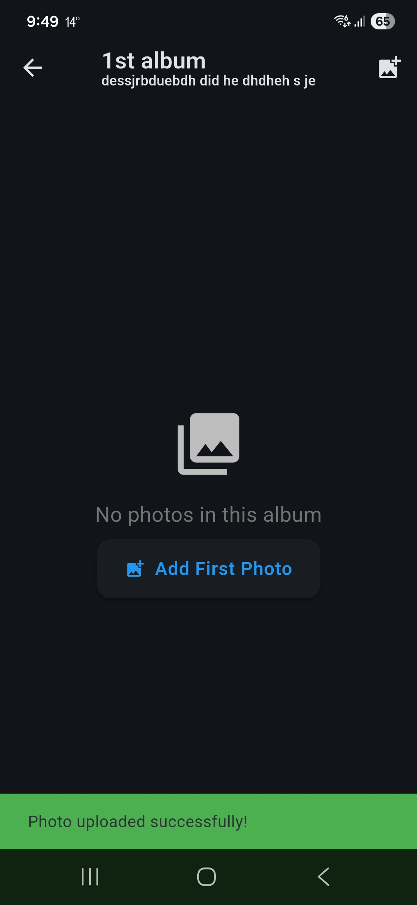
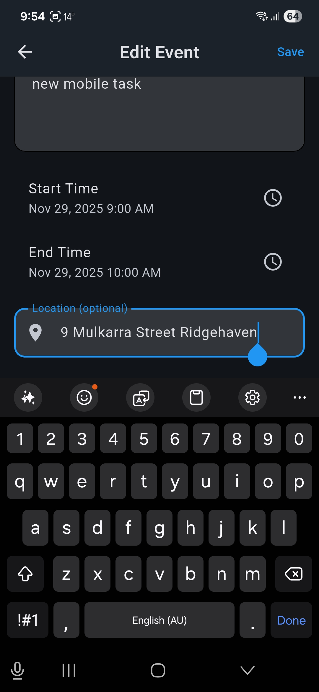
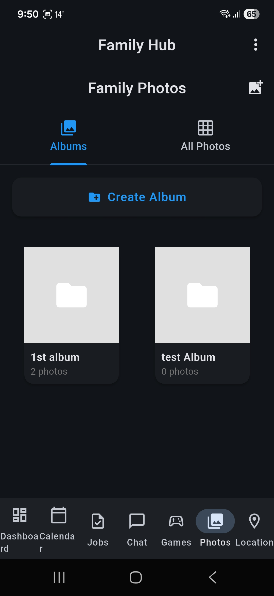
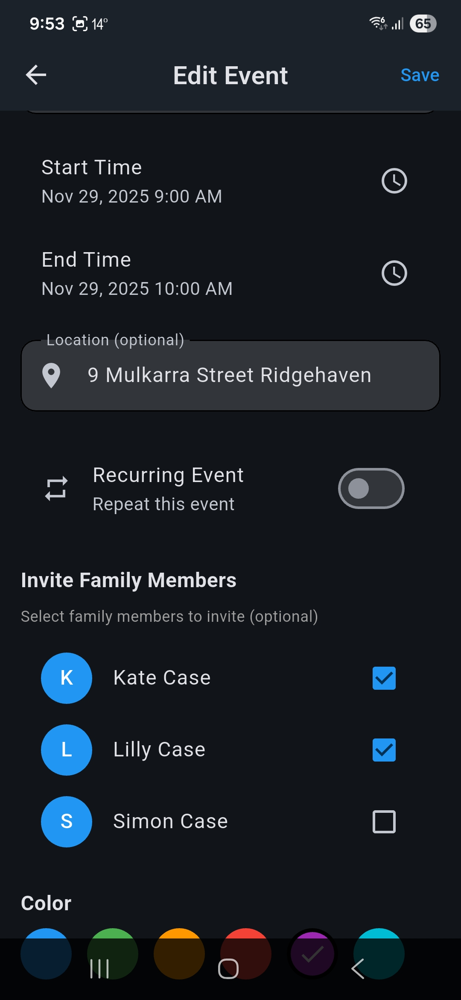
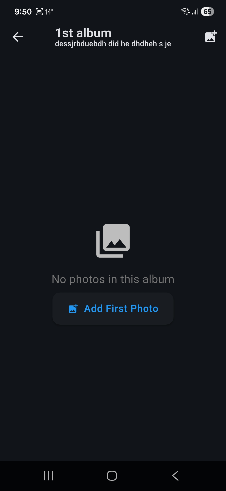
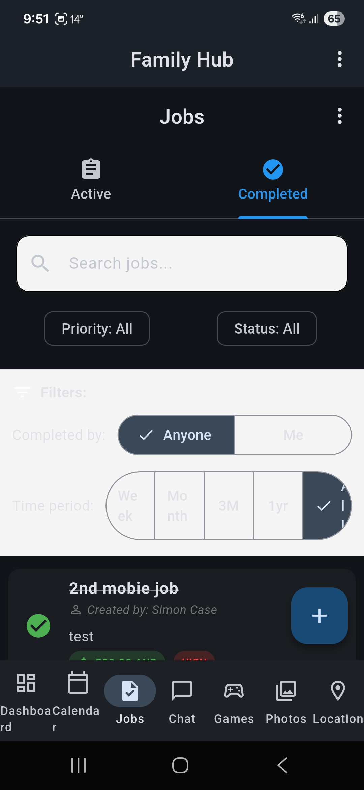
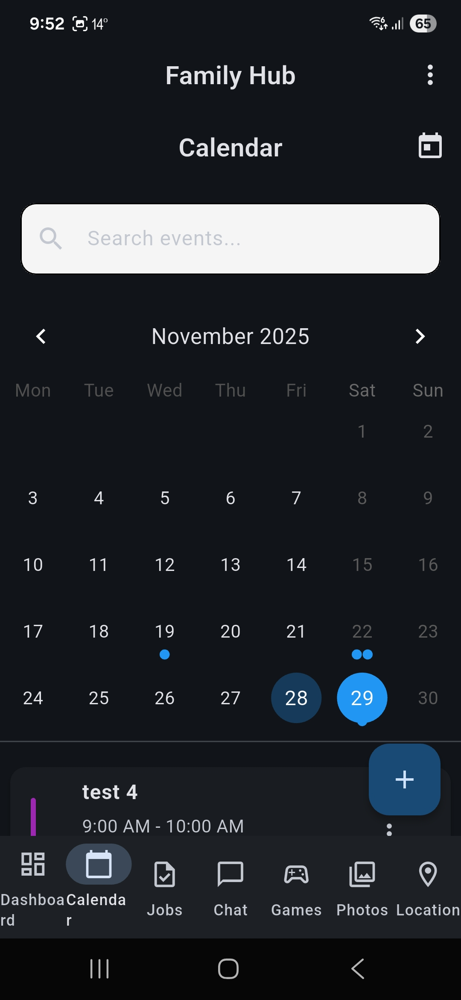
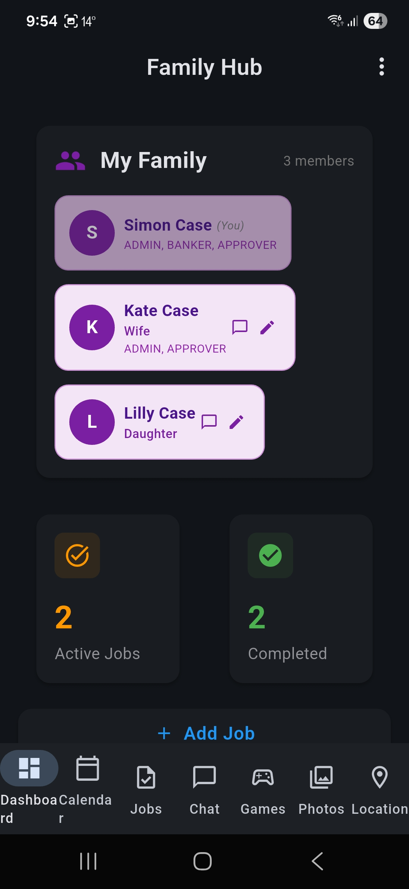
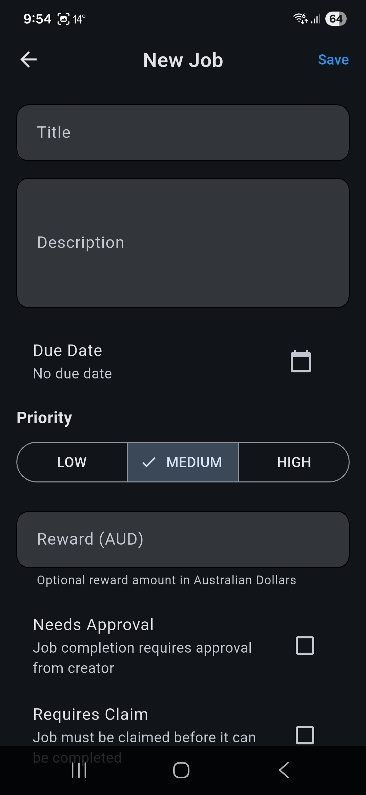

# Family Hub MVP

All-in-one family organizer: Calendar, Tasks, Chat, Location

## 📱 Overview

Family Hub is a comprehensive mobile application designed to help families stay organized and connected. The app provides four core features:

- **📅 Calendar**: Manage family events, appointments, and schedules with two-way sync to device calendars (Google, Apple, Outlook)
- **✅ Tasks**: Create and track shared family tasks and to-dos
- **💬 Chat**: Real-time family messaging and communication
- **📍 Location**: Share and view family member locations


*Main dashboard showing family overview and quick access to all features*

> **Note**: All screenshots are located in the `docs/screenshots/` directory. These images showcase the app's user interface and key features.

## 🚀 Getting Started

### Prerequisites

- Flutter SDK (>=3.0.0)
- Dart SDK (>=3.0.0)
- Android Studio / VS Code with Flutter extensions
- iOS development tools (for iOS development on macOS)
- Firebase account (for authentication and data storage)

### Installation

1. **Clone the repository**
   ```bash
   git clone https://github.com/cryptonut/familyhub-MVP.git
   cd familyhub-MVP
   ```

2. **Set up Firebase**
   - Follow the instructions in [FIREBASE_SETUP.md](FIREBASE_SETUP.md)
   - Create a Firebase project
   - Add Firebase configuration files for your platform(s)
   - Enable Email/Password authentication
   - Set up Firestore database


*Login screen with email/password authentication*

3. **Install dependencies**
   ```bash
   flutter pub get
   ```

4. **Run the app**
   ```bash
   flutter run
   ```

## ✨ Features

### Calendar Sync
FamilyHub can sync events with your device calendar (Google Calendar, Apple Calendar, Outlook, etc.):

- **Two-way sync**: Events created in FamilyHub appear in your personal calendar, and external events can be imported
- **Automatic background sync**: Syncs every 30 minutes automatically
- **Recurring events**: Full support for daily, weekly, monthly, and yearly recurring events
- **Conflict resolution**: FamilyHub events take priority when conflicts occur


*Calendar interface showing family events and sync status*

**To enable calendar sync:**
1. Go to Menu (⋮) → Calendar Sync
2. Grant calendar permissions
3. Select or create a calendar
4. Sync starts automatically

### Birthday Tracking
- Track family member birthdays
- View upcoming birthdays on the dashboard
- Receive reminders 1 day before birthdays
- Edit birthdays in Profile settings

### Enhanced Event Management
- Create recurring events (daily, weekly, monthly, yearly)
- Invite family members with RSVP tracking
- View event details with sync status indicators

### Privacy Center
- **Master toggle**: One-tap control for all active sharing
- **Active shares list**: See what you're sharing (location, calendar, birthday, geofence)
- **Individual controls**: Pause or stop specific sharing types
- **Activity log**: View last 8 privacy actions
- **Turn off all**: Instantly disable all sharing with one button


*Privacy Center showing active shares and controls*

**To access Privacy Center:**
1. Go to Menu (⋮) → Privacy Center
2. View active shares and recent activity
3. Control your sharing preferences

### Family Games
- **Three game modes**: Chess (solo vs AI, family multiplayer, open matchmaking), Word Scramble (daily + random), Family Bingo (5×5 auto-generated)
- **Real-time leaderboard**: Compete with family members
- **Stats tracking**: Wins, streaks, and personal bests
- **Confetti celebrations**: Visual feedback on wins
- **Pure fun**: No monetary rewards, just family competition


*Games selection screen with chess, word scramble, and bingo options*

**To play games:**
1. Navigate to the Games tab (bottom navigation)
2. Choose a game (Chess, Word Scramble, or Family Bingo)
3. Play and compete on the leaderboard!

### Video Calls (Agora Integration)
- **Hub-based video calls**: Start calls within any hub
- **Multi-participant support**: Grid layout for 2+ participants
- **Creator control**: Hub creators can enable/disable video calls
- **Push notifications**: Receive call invitations via FCM
- **Background handling**: Auto-mute when minimized, return via notification


*Video call screen with participant grid and controls*

**To start a video call:**
1. Open a hub (e.g., Family Hub, My Friends)
2. Tap the video camera icon in the app bar
3. Hub members receive push notifications to join
4. Full-screen video call with mute/video controls

**Note**: Video calls require Agora App ID and Certificate (configure in `lib/services/video_call_service.dart`)

### Family Photo Albums
- **Shared gallery**: Upload and organize family photos in albums
- **Photo upload**: Camera or gallery selection with automatic thumbnail generation
- **Albums**: Create custom albums to organize photos by event, date, or theme
- **Comments**: Add comments on photos for family discussions
- **View tracking**: See how many times photos have been viewed
- **Real-time updates**: Photos and comments sync in real-time across devices
- **Photo management**: Delete your own photos, view full-screen with zoom


*Photo gallery with albums and upload options*

**To use Photo Albums:**
1. Navigate to the Photos tab (bottom navigation)
2. Create an album or upload directly to "All Photos"
3. Tap any photo to view full-screen and add comments
4. Organize photos by creating albums for special events

**Note**: 
- Requires Firebase Storage to be enabled in your Firebase project
- Configure Firebase Storage rules to allow authenticated users to upload/download photos
- Photos are stored in `photos/{familyId}/{photoId}.jpg` and thumbnails in `thumbnails/{familyId}/{photoId}.jpg`

## 📁 Project Structure

```
familyhub-MVP/
├── lib/
│   ├── main.dart                 # App entry point
│   ├── models/                   # Data models
│   ├── screens/                  # UI screens
│   │   ├── home_screen.dart      # Main navigation screen
│   │   ├── calendar/             # Calendar feature screens
│   │   ├── tasks/                # Tasks feature screens
│   │   ├── chat/                 # Chat feature screens
│   │   ├── location/             # Location feature screens
│   │   ├── games/                # Family games screens
│   │   ├── settings/             # Settings screens (Privacy Center)
│   │   ├── video/                # Video call screens
│   │   └── photos/               # Photo albums screens
│   ├── services/                 # Business logic & API services
│   ├── widgets/                  # Reusable UI components
│   └── utils/                    # Utility functions
├── test/                         # Unit and widget tests
├── pubspec.yaml                  # Dependencies and project config
└── analysis_options.yaml         # Linting rules
```

## 🛠️ Tech Stack

- **Framework**: Flutter
- **Language**: Dart
- **State Management**: Provider
- **Backend**: Firebase (Authentication + Firestore)
- **HTTP Client**: Dio, HTTP
- **Local Storage**: SharedPreferences (for caching)
- **Location Services**: Geolocator, Google Maps
- **Real-time Communication**: Firestore Streams

## 📦 Key Dependencies

- `provider`: State management
- `firebase_core`: Firebase initialization
- `firebase_auth`: User authentication
- `cloud_firestore`: Cloud database with real-time sync
- `geolocator`: Location services
- `google_maps_flutter`: Map integration
- `table_calendar`: Calendar widget
- `agora_rtc_engine`: Video calling (Agora)
- `chess`: Chess puzzle game logic
- `confetti`: Celebration animations
- `permission_handler`: Device permissions
- `shared_preferences`: Local storage
- `firebase_storage`: Photo storage
- `image_picker`: Camera and gallery access
- `cached_network_image`: Efficient image loading and caching

## 🏗️ Development

### Running the App

```bash
# Run on connected device/emulator
flutter run

# Run in release mode
flutter run --release

# Run with specific device
flutter run -d <device-id>
```

### Building the App

```bash
# Build APK for Android
flutter build apk

# Build iOS app (macOS only)
flutter build ios

# Build app bundle for Play Store
flutter build appbundle
```

### Code Generation

If using code generation (e.g., Hive adapters):

```bash
flutter pub run build_runner build
```

### Testing

```bash
# Run all tests
flutter test

# Run tests with coverage
flutter test --coverage
```

## 📝 Features Status

- [x] Project setup and structure
- [x] Basic navigation and UI scaffold
- [x] Calendar feature implementation
- [x] Tasks feature implementation
  
- [x] Chat feature implementation
- [x] Location feature implementation
- [x] User authentication (Firebase Auth)
- [x] Backend integration (Firestore)
- [x] Real-time data sync
- [x] Data persistence
- [x] Privacy Center with sharing controls
- [x] Family Games (Chess, Word Scramble, Bingo)
- [x] Video Calls (Agora integration)
- [x] Family Photo Albums with comments
- [x] Push notifications
- [x] Family invitation system
- [x] Chess game (solo, family, open multiplayer)
- [ ] Google Maps integration


*Chess game interface with real-time multiplayer support*

## 🔒 Security

- Environment variables are stored in `.env` files (not committed to git)
- API keys should be stored securely and never hardcoded
- Use secure storage for sensitive user data

## 🤝 Contributing

1. Fork the repository
2. Create a feature branch (`git checkout -b feature/amazing-feature`)
3. Commit your changes (`git commit -m 'Add some amazing feature'`)
4. Push to the branch (`git push origin feature/amazing-feature`)
5. Open a Pull Request

## 📄 License

This project is licensed under the MIT License - see the [LICENSE](LICENSE) file for details.

## 👤 Author

Simon Case

## 🙏 Acknowledgments

- Flutter team for the amazing framework
- All open-source contributors whose packages make this project possible

---

**Note**: This is an MVP (Minimum Viable Product) and is actively under development.
